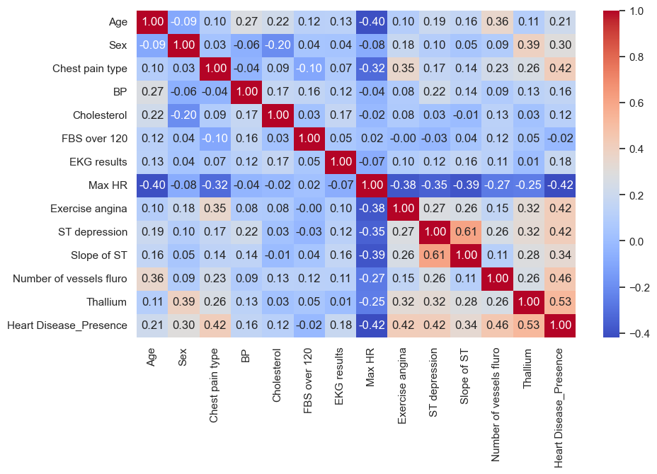
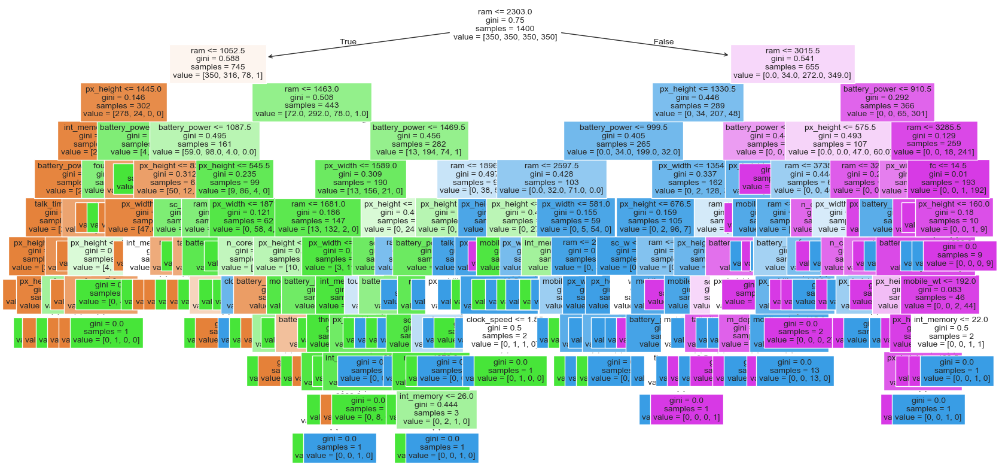
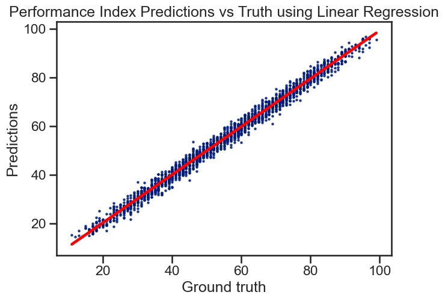
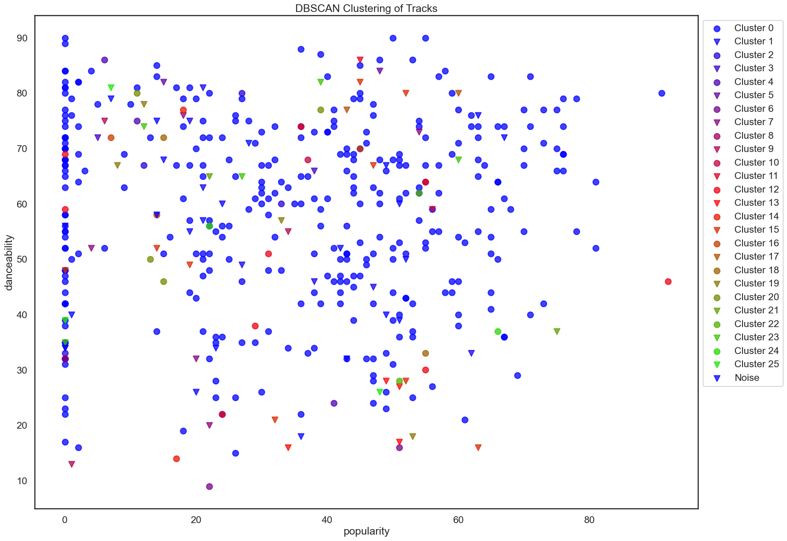

# Machine Learning Series

A progressive series of machine learning projects in Python, covering the full supervised and unsupervised learning workflow - from exploratory data analysis through classification, regression, and clustering.

**Author:** J. Wong

---

| | |
|:---:|:---:|
|  |  |
|  |  |

---

## Projects

### 1. Exploratory Data Analysis
**Dataset:** [Heart Disease - Kaggle (Neurocipher)](https://www.kaggle.com/datasets/neurocipher/heartdisease/data)

Comprehensive EDA on a 270-patient heart disease dataset. Covers data cleaning, correlation analysis, feature engineering, PCA, and frequentist hypothesis testing across four hypotheses.

**Topics:** Correlation heatmaps · Polynomial & deviation features · PCA (11 components → 95% variance) · t-tests · ANOVA · Chi-square

---

### 2. Classification
**Dataset:** [Mobile Price Classification - Kaggle (A. Sharma)](https://www.kaggle.com/datasets/iabhishekofficial/mobile-price-classification)

Benchmarks 10+ classification algorithms on a 4-class mobile pricing problem, with full hyperparameter tuning and model interpretability analysis.

**Topics:** Logistic Regression · KNN · SVM · Decision Trees · Random Forest · Gradient Boosting · XGBoost · LIME · Permutation Importance

---

### 3. Regression
**Dataset:** [Student Performance - Kaggle (N. Narayan)](https://www.kaggle.com/datasets/nikhil7280/student-performance-multiple-linear-regression)

Validates regression assumptions and systematically evaluates regression techniques with cross-validation and regularization. Achieves R² ≈ 0.989.

**Topics:** Linear & Polynomial Regression · Lasso (L1) · Ridge (L2) · K-Fold Cross-Validation · GridSearchCV · Pipeline

---

### 4. Unsupervised Learning
**Datasets:** [Spotify Tracks - Kaggle (MaharshiPandya)](https://www.kaggle.com/datasets/maharshipandya/-spotify-tracks-dataset) · [Sign Language MNIST - Kaggle (tecperson)](https://www.kaggle.com/datasets/datamunge/sign-language-mnist)

Applies dimensionality reduction and clustering to both tabular and image data, including pixel-level image segmentation and t-SNE visualization of hand sign embeddings.

**Topics:** PCA · KernelPCA · t-SNE · KMeans · DBSCAN · MeanShift · Agglomerative Clustering · Gaussian Mixture Models

---

## Technologies

`Python` `scikit-learn` `pandas` `NumPy` `Matplotlib` `Seaborn` `Plotly` `XGBoost` `SciPy` `Statsmodels` `OpenCV` `KaggleHub`
